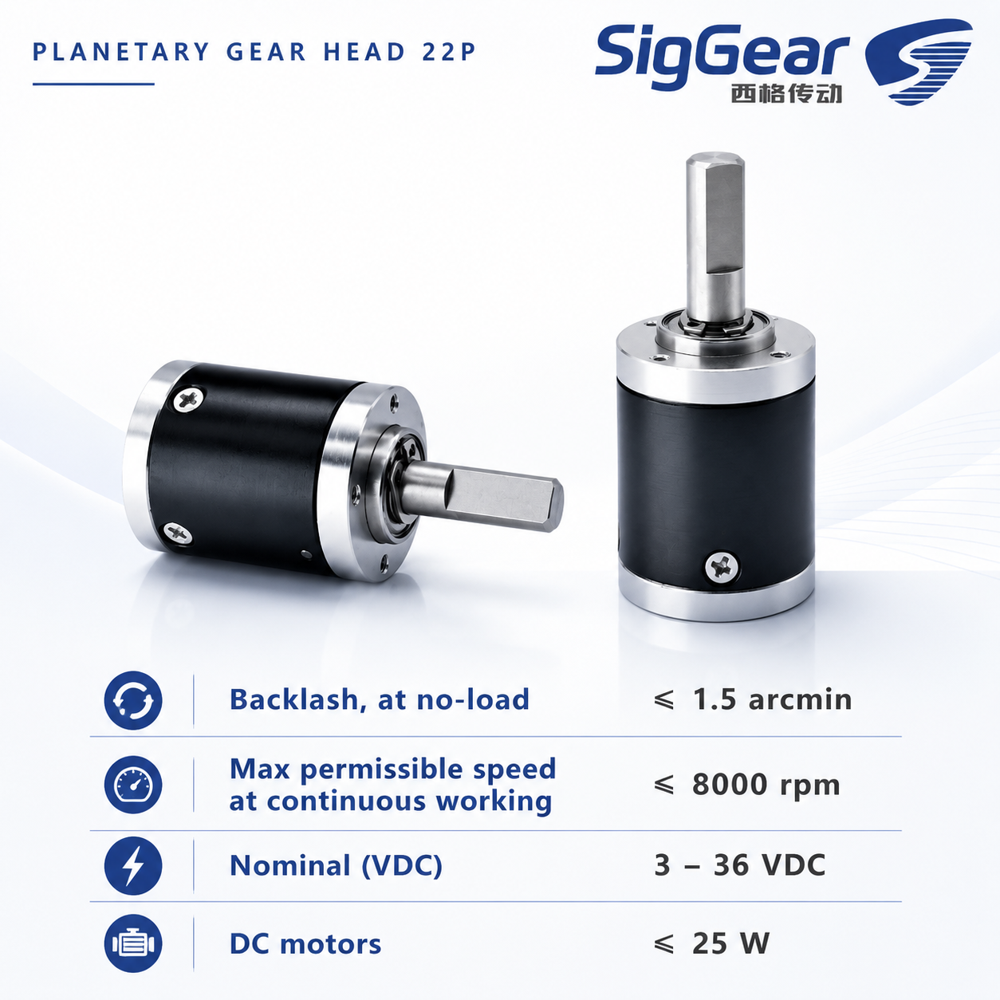
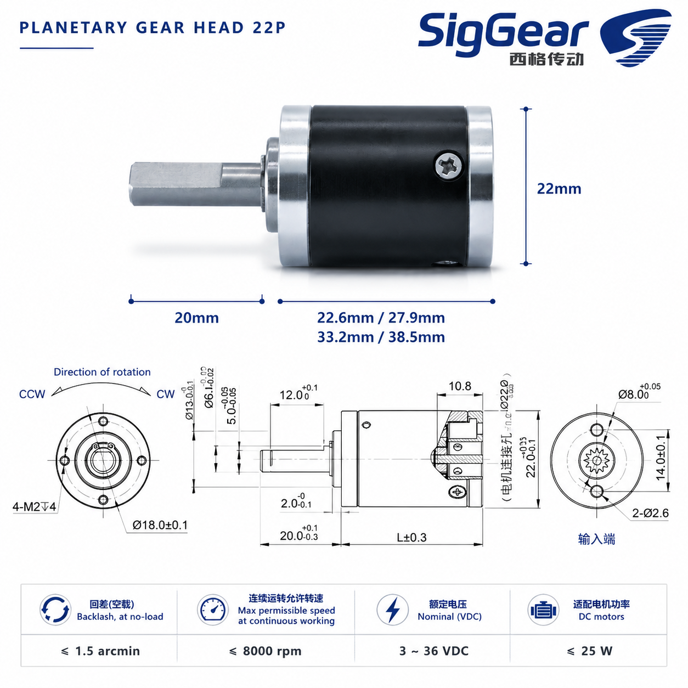
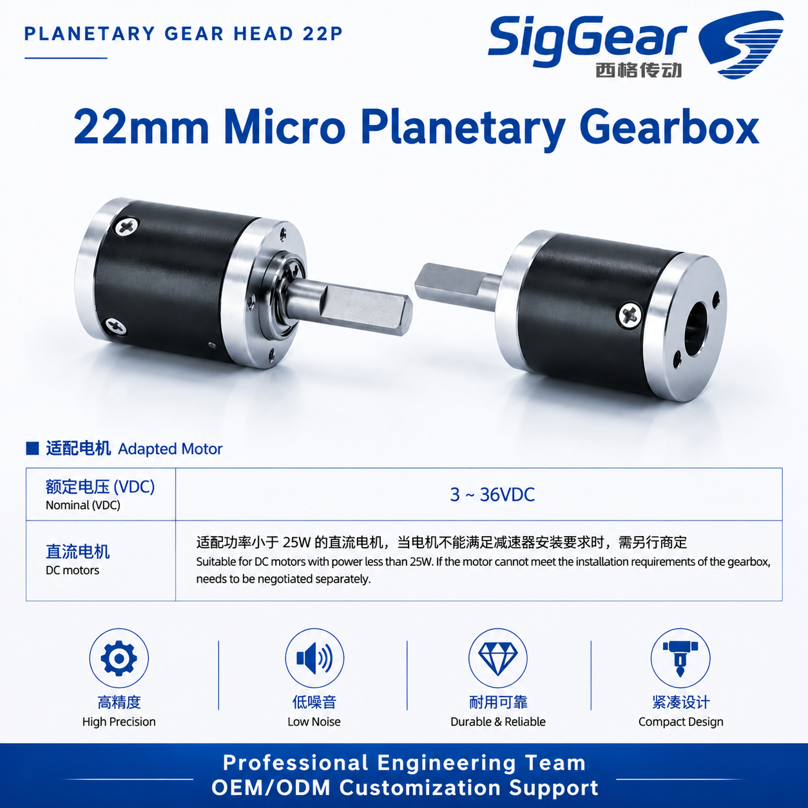
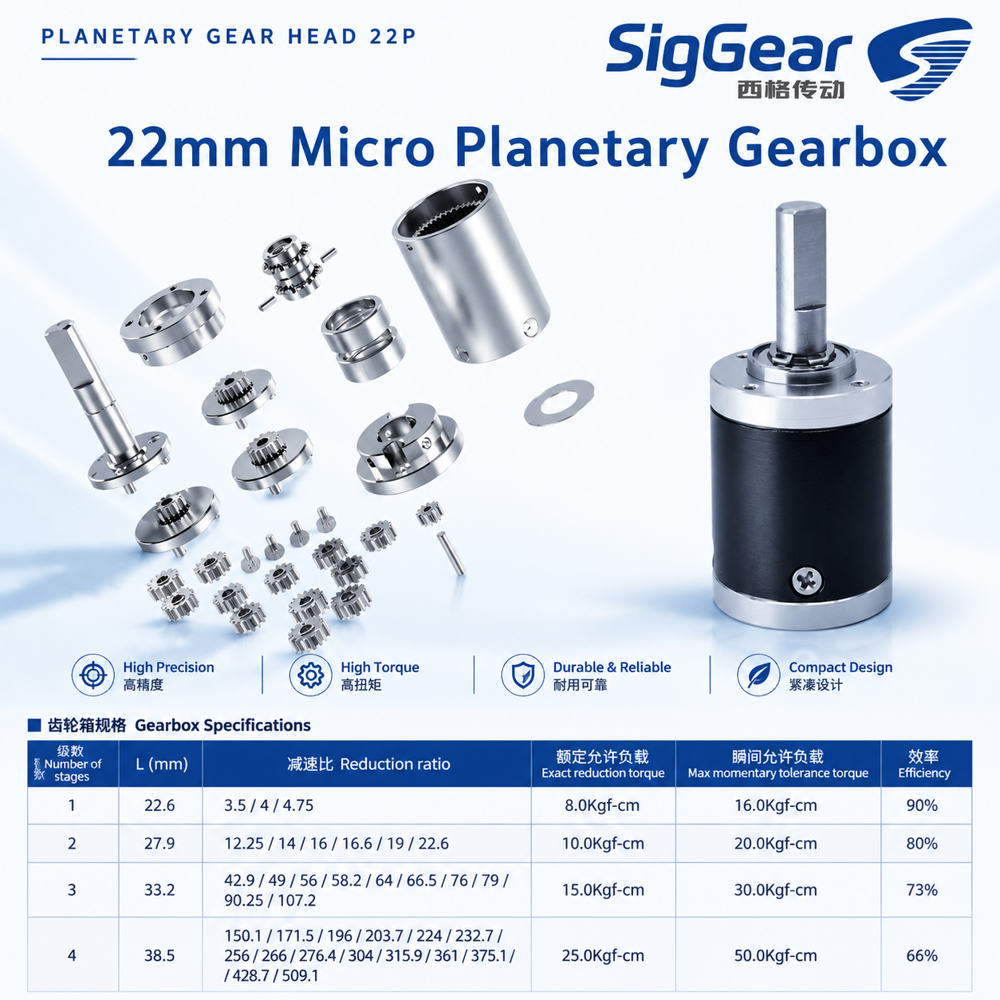
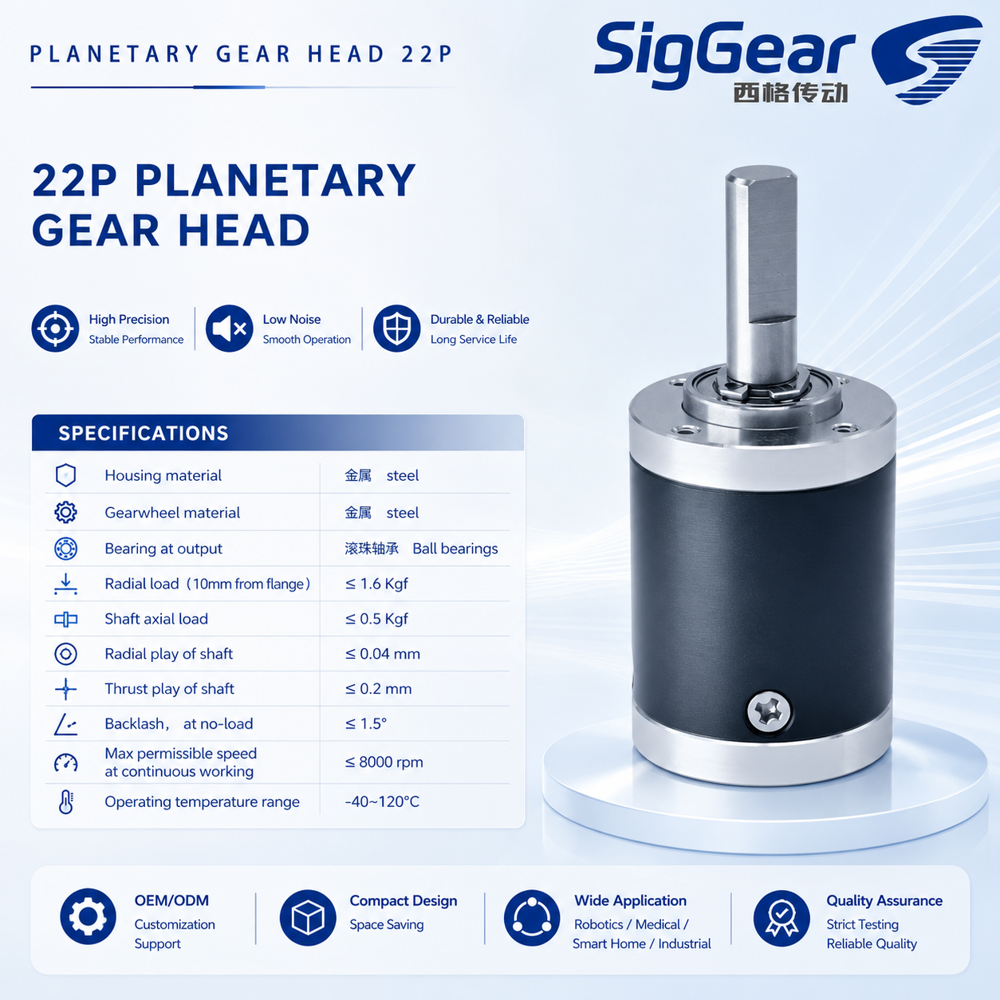
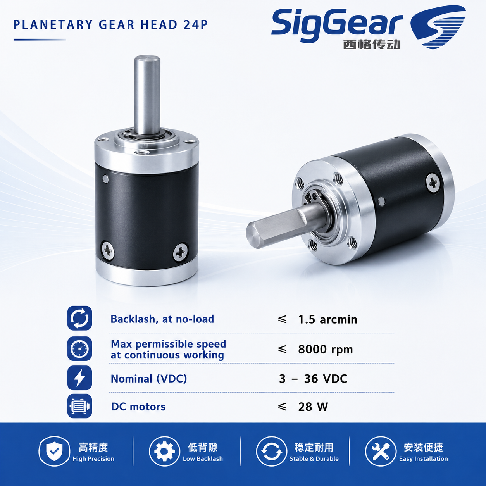
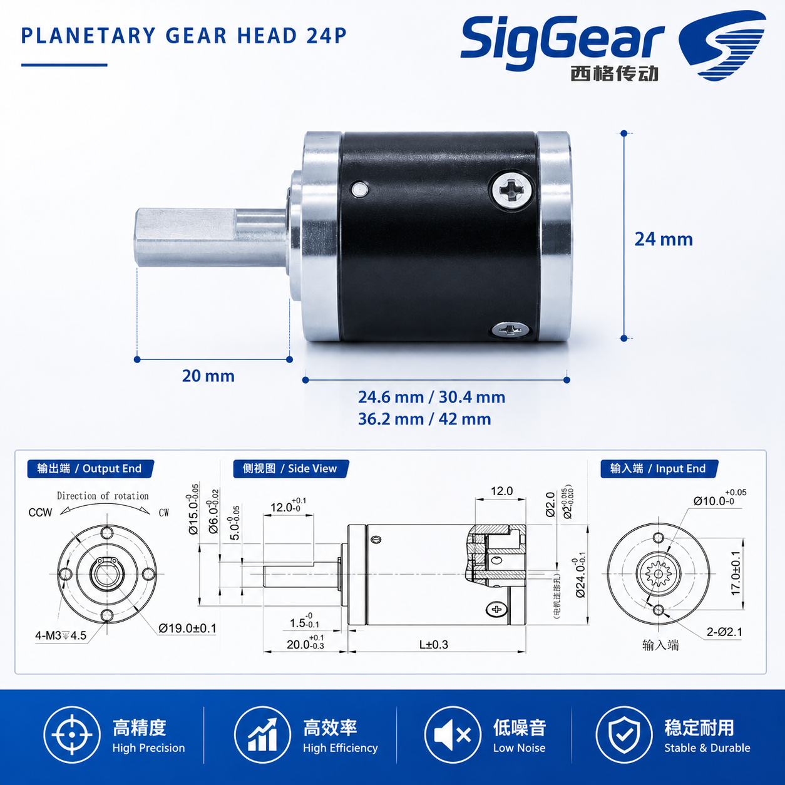
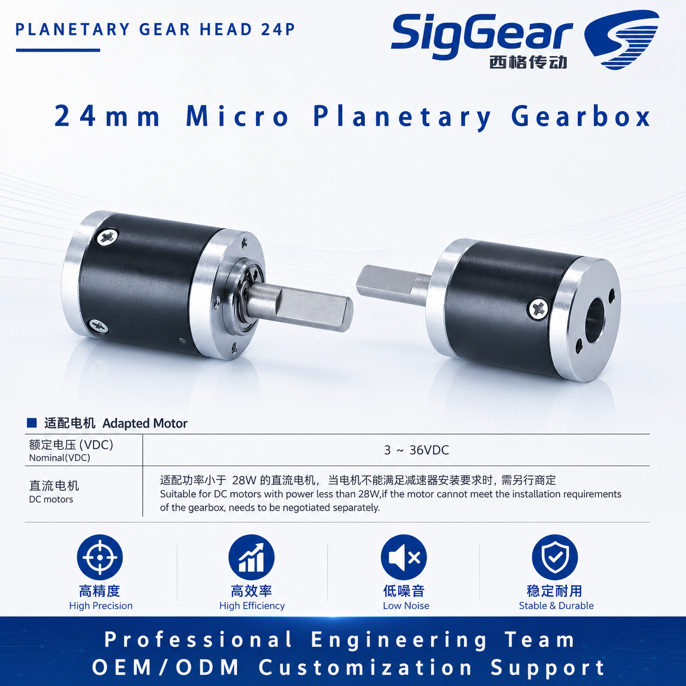
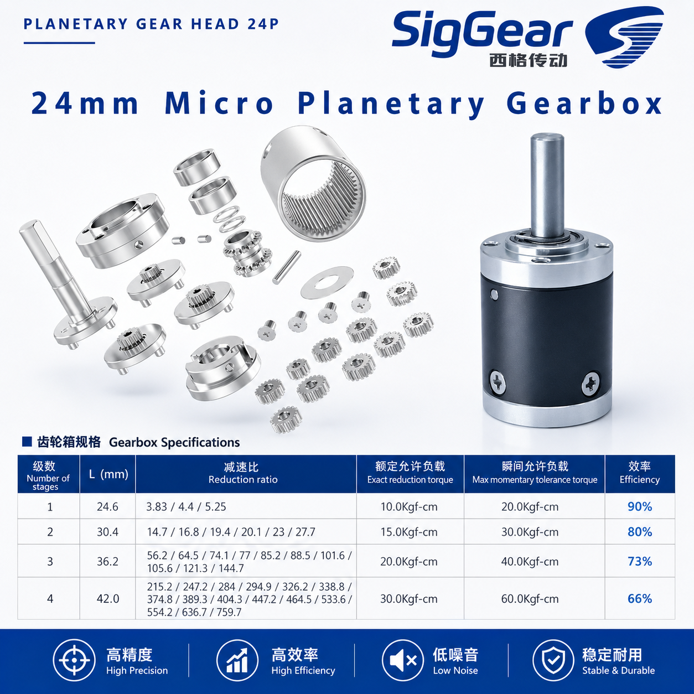
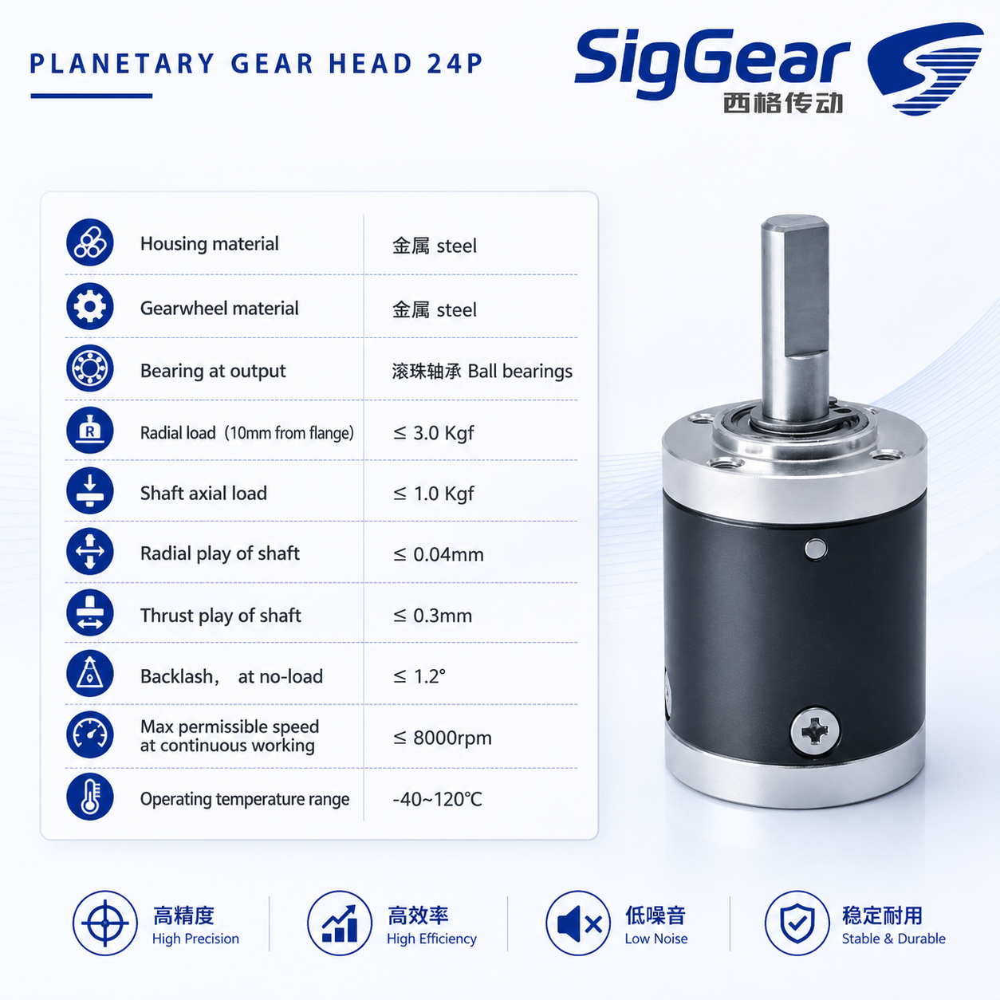

---

title: 6-42mm Planetary Gear Reducer
description: SigGear provides 6-42mm miniature and compact planetary gear reducers for micro robotics, precision automation, medical devices, lab automation, optical equipment, servo drives, and compact motion systems.
--------------------------------------------------------------------------------------------------------------------------------------------------------------------------------------------------------------------------

# 6-42mm Planetary Gear Reducer

SigGear provides miniature and compact planetary gear reducers from 6mm to 42mm for micro robotics, precision automation, medical devices, laboratory automation, optical equipment, smart hardware, servo drive modules, and compact industrial motion systems.

The SigGear planetary gear reducer series is designed for applications that require compact size, stable output torque, low noise, flexible reduction ratios, durable metal gear transmission, and easy integration with DC motors, brushless motors, stepper motors, servo motors, or customized motor assemblies.

For engineers developing compact mechanisms, small robotic actuators, medical motion devices, optical adjustment systems, laboratory automation equipment, or precision automation systems, SigGear can help evaluate a suitable standard planetary gearbox or customized drive solution.

## Product Overview

Planetary gear reducers are widely used in compact motion systems because they provide speed reduction, torque increase, stable transmission, and compact mechanical layout.

SigGear 6-42mm planetary gear reducers are available in multiple diameter ranges, including 6mm, 8mm, 10mm, 12mm, 14mm, 16mm, 20mm, 22mm, 24mm, 28mm, 32mm, 36mm, and 42mm. Different sizes can support different gear stages, reduction ratios, output torque ranges, shaft designs, mounting interfaces, and motor matching requirements.

| Product Range                  | Type                              | Suitable Applications                                                               |
| ------------------------------ | --------------------------------- | ----------------------------------------------------------------------------------- |
| 6mm Planetary Gear Reducer     | Ultra-miniature planetary reducer | Micro robotics, miniature mechanisms, precision instruments                         |
| 8-10mm Planetary Gear Reducer  | Miniature planetary reducer       | Small grippers, micro actuators, medical devices, optical equipment                 |
| 12-16mm Planetary Gear Reducer | Micro planetary gearbox           | Lab automation, smart hardware, small robotic mechanisms                            |
| 20-24mm Planetary Gear Reducer | Compact planetary gearbox         | Automation modules, small servo systems, compact motion devices                     |
| 28-42mm Planetary Gear Reducer | Precision planetary gearbox       | Robotics, industrial automation, servo drive modules, higher torque compact systems |

## Key Features

| Feature                         | Benefit                                                                                              |
| ------------------------------- | ---------------------------------------------------------------------------------------------------- |
| Diameter range from 6mm to 42mm | Covers miniature, micro, and compact motion system requirements.                                     |
| Planetary gear structure        | Provides compact transmission and stable torque output.                                              |
| Metal housing                   | Supports durable structure and reliable mechanical performance.                                      |
| Metal gearwheel material        | Improves strength, durability, and load capability.                                                  |
| Ball bearings at output         | Supports smoother output and better shaft stability.                                                 |
| Multiple gear ratio options     | Helps balance output speed, torque, efficiency, and control response.                                |
| Low noise design                | Suitable for medical devices, laboratory equipment, optical systems, and indoor applications.        |
| Compact design                  | Helps save installation space in small mechanisms and robotic systems.                               |
| OEM / ODM customization         | Supports custom shaft, ratio, mounting, motor matching, encoder, brake, wire, and connector options. |

## General Technical Characteristics

The following general characteristics are available across the SigGear miniature and compact planetary gearbox series. Final values depend on gearbox diameter, gear stage, ratio, motor matching, and custom design.

| Item                                        | Specification                                                                                     |
| ------------------------------------------- | ------------------------------------------------------------------------------------------------- |
| Housing material                            | Steel                                                                                             |
| Gearwheel material                          | Steel                                                                                             |
| Bearing at output                           | Ball bearings                                                                                     |
| Max permissible speed at continuous working | Up to 8000 rpm                                                                                    |
| Operating temperature range                 | -40°C to 120°C                                                                                    |
| Nominal voltage with matched DC motor       | 3-36 VDC, depending on motor selection                                                            |
| Motor matching                              | DC motor, brushless motor, stepper motor, servo motor, or custom motor assembly                   |
| Process                                     | Machining                                                                                         |
| Customization                               | Gear ratio, shaft, flange, mounting interface, motor integration, encoder, brake, wire, connector |

## Size and Performance Summary

The table below summarizes key specifications from the SigGear 6-42mm planetary gearbox series. Values are reference values for product evaluation. Please contact SigGear for final drawings, torque confirmation, motor matching, and custom requirements.

| Model Size | Outer Diameter |         Length / Height Range | Backlash at No Load | Reduction Ratio Range | Rated Allowable Torque | Max Momentary Tolerance Torque |
| ---------- | -------------: | ----------------------------: | ------------------: | --------------------: | ---------------------: | -----------------------------: |
| 6P         |            6mm |               Contact SigGear |     Contact SigGear |        Custom options |        Contact SigGear |                Contact SigGear |
| 8P         |            8mm |               Contact SigGear |              ≤ 1.5° |       Contact SigGear |        Contact SigGear |                Contact SigGear |
| 10P        |           10mm |               Contact SigGear |        ≤ 1.5 arcmin |       Contact SigGear |        Contact SigGear |                Contact SigGear |
| 12P        |           12mm | 11.35 / 14.1 / 16.85 / 19.6mm |     Contact SigGear |       Contact SigGear |        Contact SigGear |                Contact SigGear |
| 14P        |           14mm |                   15.2-26.6mm |     Contact SigGear |            3.75-443.3 |         3.5-6.0 Kgf-cm |                7.0-12.0 Kgf-cm |
| 16P        |           16mm |                 17.55-30.45mm |              ≤ 1.5° |            3.85-459.5 |         4.0-9.0 Kgf-cm |                8.0-26.0 Kgf-cm |
| 20P        |           20mm |   20.1 / 24.9 / 29.7 / 34.5mm |              ≤ 1.5° |       Contact SigGear |        Contact SigGear |                Contact SigGear |
| 22P        |           22mm |   22.6 / 27.9 / 33.2 / 38.5mm |        ≤ 1.5 arcmin |       Contact SigGear |        Contact SigGear |                Contact SigGear |
| 24P        |           24mm |     24.6 / 30.4 / 36.2 / 42mm |              ≤ 1.2° |       Contact SigGear |        Contact SigGear |                Contact SigGear |
| 28P        |           28mm |                   25.6-44.5mm |              ≤ 1.2° |            3.83-759.7 |           20-50 Kgf-cm |                  40-100 Kgf-cm |
| 32P        |           32mm |                    28-52.95mm |              ≤ 1.2° |             3.5-509.1 |           35-80 Kgf-cm |                  70-160 Kgf-cm |
| 36P        |           36mm |                   30.6-61.5mm |              ≤ 1.2° |              3.66-625 |          40-100 Kgf-cm |                  80-200 Kgf-cm |
| 42P        |           42mm |                   35.6-69.5mm |              ≤ 1.2° |             3.8-660.7 |          80-150 Kgf-cm |                 160-300 Kgf-cm |

## 8P Planetary Gear Head

The 8P planetary gear head is suitable for ultra-compact motion systems where space is extremely limited. It can be used in miniature mechanisms, compact instruments, micro robotics, and precision motion devices.

| Item                                        | Specification  |
| ------------------------------------------- | -------------- |
| Housing material                            | Steel          |
| Gearwheel material                          | Steel          |
| Bearing at output                           | Ball bearings  |
| Radial load, 10mm from flange               | ≤ 0.4 Kgf      |
| Shaft axial load                            | ≤ 0.1 Kgf      |
| Radial play of shaft                        | ≤ 0.04mm       |
| Thrust play of shaft                        | ≤ 0.15mm       |
| Backlash at no load                         | ≤ 1.5°         |
| Max permissible speed at continuous working | ≤ 8000 rpm     |
| Operating temperature range                 | -40°C to 120°C |

## 10P Planetary Gear Head

The 10P planetary gear head is designed for compact applications requiring small size, low backlash, and smooth operation. It can be matched with small DC motors for compact drive assemblies.

| Item                                        | Specification |
| ------------------------------------------- | ------------- |
| Outer diameter                              | 10mm          |
| Backlash at no load                         | ≤ 1.5 arcmin  |
| Max permissible speed at continuous working | ≤ 8000 rpm    |
| Nominal voltage with matched DC motor       | 3-36 VDC      |
| DC motor power                              | ≤ 3W          |

## 12P Micro Planetary Gearbox

The 12mm micro planetary gearbox is suitable for compact robotic mechanisms, small grippers, laboratory automation, optical adjustment systems, and precision instruments.

| Item                        | Specification                                                                      |
| --------------------------- | ---------------------------------------------------------------------------------- |
| Outer diameter              | 12mm                                                                               |
| Output shaft length         | 10mm                                                                               |
| Gearbox body length options | 11.35mm / 14.1mm / 16.85mm / 19.6mm                                                |
| Features                    | High precision, durable and reliable, low noise, compact design                    |
| Suitable applications       | Micro robotics, small grippers, medical devices, lab automation, optical equipment |

## 14P Micro Planetary Gearbox

The 14mm micro planetary gearbox provides multiple reduction ratio options and compact torque output for small robotic and automation applications.

| Number of Stages | L Length | Reduction Ratio                                                                                            | Rated Allowable Torque | Max Momentary Tolerance Torque | Efficiency |
| ---------------: | -------: | ---------------------------------------------------------------------------------------------------------- | ---------------------: | -----------------------------: | ---------: |
|                1 |   15.2mm | 3.75 / 4.38 / 4.66                                                                                         |             3.5 Kgf-cm |                     7.0 Kgf-cm |        90% |
|                2 |   19.0mm | 14 / 16.4 / 17.5 / 19.2 / 20.4 / 21.7                                                                      |             4.0 Kgf-cm |                     8.0 Kgf-cm |        80% |
|                3 |   22.8mm | 52.7 / 61.6 / 65.5 / 71.9 / 76.5 / 81.4 / 84 / 89.4 / 95.1 / 101.2                                         |             5.0 Kgf-cm |                    10.0 Kgf-cm |        73% |
|                4 |   26.6mm | 197.75 / 231 / 245.74 / 269.8 / 287 / 305.4 / 315.1 / 335.25 / 356.7 / 368 / 379.5 / 391.6 / 416.6 / 443.3 |             6.0 Kgf-cm |                    12.0 Kgf-cm |        66% |

## 16P Micro Planetary Gearbox

The 16mm micro planetary gearbox offers higher torque capacity than smaller models while maintaining compact structure and multiple gear stage options.

| Number of Stages | L Length | Reduction Ratio                                                                                                       | Rated Allowable Torque | Max Momentary Tolerance Torque | Efficiency |
| ---------------: | -------: | --------------------------------------------------------------------------------------------------------------------- | ---------------------: | -----------------------------: | ---------: |
|                1 |  17.55mm | 3.85 / 4.33 / 4.63                                                                                                    |             4.0 Kgf-cm |                     8.0 Kgf-cm |        90% |
|                2 |  21.85mm | 14.8 / 16.7 / 17.8 / 18.7 / 20 / 21.4                                                                                 |             5.0 Kgf-cm |                    10.0 Kgf-cm |        80% |
|                3 |  26.15mm | 57.1 / 64.2 / 68.6 / 72.2 / 77.2 / 81.2 / 82.5 / 86.8 / 92.8 / 99.25                                                  |             7.0 Kgf-cm |                    20.0 Kgf-cm |        73% |
|                4 |  30.45mm | 219.7 / 247 / 264.2 / 277.9 / 297.2 / 312.55 / 317.75 / 334.2 / 351.5 / 357.4 / 375.9 / 382.1 / 401.9 / 429.8 / 459.5 |             9.0 Kgf-cm |                    26.0 Kgf-cm |        66% |

### 16P General Specifications

| Item                                        | Specification  |
| ------------------------------------------- | -------------- |
| Housing material                            | Steel          |
| Gearwheel material                          | Steel          |
| Bearing at output                           | Ball bearings  |
| Radial load, 10mm from flange               | ≤ 1.6 Kgf      |
| Shaft axial load                            | ≤ 0.5 Kgf      |
| Radial play of shaft                        | ≤ 0.04mm       |
| Thrust play of shaft                        | ≤ 0.2mm        |
| Backlash at no load                         | ≤ 1.5°         |
| Max permissible speed at continuous working | ≤ 8000 rpm     |
| Operating temperature range                 | -40°C to 120°C |

## 20P Planetary Gear Head

The 20P planetary gear head is suitable for compact automation modules, small servo drive systems, and robotic mechanisms requiring a stronger gearbox structure.

| Item                                        | Specification                     |
| ------------------------------------------- | --------------------------------- |
| Outer diameter                              | 20mm                              |
| Output shaft length                         | 12mm                              |
| Gearbox body length options                 | 20.1mm / 24.9mm / 29.7mm / 34.5mm |
| Housing material                            | Steel                             |
| Gearwheel material                          | Steel                             |
| Bearing at output                           | Ball bearings                     |
| Radial load, 10mm from flange               | ≤ 1.6 Kgf                         |
| Shaft axial load                            | ≤ 0.5 Kgf                         |
| Radial play of shaft                        | ≤ 0.04mm                          |
| Thrust play of shaft                        | ≤ 0.2mm                           |
| Backlash at no load                         | ≤ 1.5°                            |
| Max permissible speed at continuous working | ≤ 8000 rpm                        |
| Operating temperature range                 | -40°C to 120°C                    |

## 22P Planetary Gear Head

The 22P planetary gear head provides compact size, stronger load capacity, and motor matching flexibility for robotics, medical devices, smart home devices, and industrial automation applications.

| Item                                        | Specification                     |
| ------------------------------------------- | --------------------------------- |
| Outer diameter                              | 22mm                              |
| Output shaft length                         | 20mm                              |
| Gearbox body length options                 | 22.6mm / 27.9mm / 33.2mm / 38.5mm |
| Backlash at no load                         | ≤ 1.5 arcmin                      |
| Max permissible speed at continuous working | ≤ 8000 rpm                        |
| Nominal voltage with matched DC motor       | 3-36 VDC                          |
| DC motor power                              | ≤ 25W                             |

### 22P General Specifications

| Item                                        | Specification  |
| ------------------------------------------- | -------------- |
| Housing material                            | Steel          |
| Gearwheel material                          | Steel          |
| Bearing at output                           | Ball bearings  |
| Radial load, 10mm from flange               | ≤ 1.6 Kgf      |
| Shaft axial load                            | ≤ 0.5 Kgf      |
| Radial play of shaft                        | ≤ 0.04mm       |
| Thrust play of shaft                        | ≤ 0.2mm        |
| Backlash at no load                         | ≤ 1.5°         |
| Max permissible speed at continuous working | ≤ 8000 rpm     |
| Operating temperature range                 | -40°C to 120°C |

## 24P Planetary Gear Head

The 24P planetary gear head is suitable for compact motion systems requiring higher load capacity than smaller micro planetary gearboxes.

| Item                                        | Specification                   |
| ------------------------------------------- | ------------------------------- |
| Outer diameter                              | 24mm                            |
| Output shaft length                         | 20mm                            |
| Gearbox body length options                 | 24.6mm / 30.4mm / 36.2mm / 42mm |
| Housing material                            | Steel                           |
| Gearwheel material                          | Steel                           |
| Bearing at output                           | Ball bearings                   |
| Radial load, 10mm from flange               | ≤ 3.0 Kgf                       |
| Shaft axial load                            | ≤ 1.0 Kgf                       |
| Radial play of shaft                        | ≤ 0.04mm                        |
| Thrust play of shaft                        | ≤ 0.3mm                         |
| Backlash at no load                         | ≤ 1.2°                          |
| Max permissible speed at continuous working | ≤ 8000 rpm                      |
| Operating temperature range                 | -40°C to 120°C                  |

## 28P Planetary Gearbox

The 28mm planetary gearbox is suitable for higher torque compact mechanisms, automation modules, and robotic drive assemblies.

| Item                         | Specification |
| ---------------------------- | ------------- |
| Outer diameter               | 28mm          |
| Height range                 | 25.6-44.5mm   |
| Backlash at no load          | ≤ 1.2°        |
| Reduction ratio range        | 3.83-759.7    |
| Rated allowable load         | 20-50 Kgf-cm  |
| Instantaneous allowable load | 40-100 Kgf-cm |
| Process                      | Machining     |

### 28P Gearbox Specifications

| Number of Stages | L Length | Reduction Ratio                                                                                                     | Rated Allowable Torque | Max Momentary Tolerance Torque | Efficiency |
| ---------------: | -------: | ------------------------------------------------------------------------------------------------------------------- | ---------------------: | -----------------------------: | ---------: |
|                1 |   25.6mm | 3.83 / 4.4 / 5.25                                                                                                   |            20.0 Kgf-cm |                    40.0 Kgf-cm |        90% |
|                2 |   31.9mm | 14.7 / 16.8 / 19.4 / 20.1 / 23 / 27.7                                                                               |            25.0 Kgf-cm |                    50.0 Kgf-cm |        80% |
|                3 |   38.2mm | 56.2 / 64.5 / 74.1 / 77 / 85.2 / 88.5 / 101.6 / 105.6 / 121.3 / 144.7                                               |            35.0 Kgf-cm |                    70.0 Kgf-cm |        73% |
|                4 |   44.5mm | 215.2 / 247.2 / 284 / 294.9 / 326.2 / 338.8 / 374.8 / 389.3 / 404.3 / 447.2 / 464.5 / 533.6 / 554.2 / 636.7 / 759.7 |            50.0 Kgf-cm |                   100.0 Kgf-cm |        66% |

## 32P Planetary Gearbox

The 32mm planetary gearbox provides higher torque capability and a compact structure for robotic and industrial automation applications.

| Item                         | Specification |
| ---------------------------- | ------------- |
| Outer diameter               | 32mm          |
| Height range                 | 28-52.95mm    |
| Backlash at no load          | ≤ 1.2°        |
| Reduction ratio range        | 3.5-509.1     |
| Rated allowable load         | 35-80 Kgf-cm  |
| Instantaneous allowable load | 70-160 Kgf-cm |
| Process                      | Machining     |

### 32P Gearbox Specifications

| Number of Stages | L Length | Reduction Ratio                                                                                           | Rated Allowable Torque | Max Momentary Tolerance Torque | Efficiency |
| ---------------: | -------: | --------------------------------------------------------------------------------------------------------- | ---------------------: | -----------------------------: | ---------: |
|                1 |  28.05mm | 3.5 / 4 / 4.75                                                                                            |            35.0 Kgf-cm |                    70.0 Kgf-cm |        90% |
|                2 |  36.35mm | 12.2 / 14 / 16 / 16.6 / 19 / 22.6                                                                         |            50.0 Kgf-cm |                   100.0 Kgf-cm |        80% |
|                3 |  44.65mm | 42.9 / 49 / 56 / 58.2 / 64 / 66.5 / 76 / 79 / 90.2 / 107.2                                                |            65.0 Kgf-cm |                   130.0 Kgf-cm |        73% |
|                4 |  52.95mm | 150.1 / 171.5 / 196 / 203.7 / 224 / 232.7 / 256 / 266 / 276.4 / 304 / 315.9 / 361 / 375.1 / 428.7 / 509.1 |            80.0 Kgf-cm |                   160.0 Kgf-cm |        66% |

## 36P Planetary Gearbox

The 36mm planetary gearbox is suitable for compact automation equipment, higher torque motion modules, and industrial robotic mechanisms.

| Item                         | Specification |
| ---------------------------- | ------------- |
| Outer diameter               | 36mm          |
| Height range                 | 30.6-61.5mm   |
| Backlash at no load          | ≤ 1.2°        |
| Reduction ratio range        | 3.66-625      |
| Rated allowable load         | 40-100 Kgf-cm |
| Instantaneous allowable load | 80-200 Kgf-cm |
| Process                      | Machining     |

## 42P Planetary Gearbox

The 42mm planetary gearbox provides the highest torque capacity in this product range and is suitable for compact industrial automation, servo drive modules, robotic mechanisms, and custom motion control systems.

| Item                         | Specification  |
| ---------------------------- | -------------- |
| Outer diameter               | 42mm           |
| Height range                 | 35.6-69.5mm    |
| Backlash at no load          | ≤ 1.2°         |
| Reduction ratio range        | 3.8-660.7      |
| Rated allowable load         | 80-150 Kgf-cm  |
| Instantaneous allowable load | 160-300 Kgf-cm |
| Process                      | Machining      |

## Typical Applications

SigGear 6-42mm planetary gear reducers can be used in:

* Micro robotics
* Small robotic grippers
* Miniature robotic arms
* Medical devices
* Laboratory automation equipment
* Optical adjustment systems
* Precision instruments
* Smart home devices
* Smart hardware
* Compact actuators
* Mini pumps
* Small valve control systems
* Inspection devices
* Educational robotics
* Servo drive modules
* AGV / AMR auxiliary mechanisms
* Industrial automation equipment
* Packaging equipment
* Small conveyor mechanisms
* Custom motion control systems

## How to Select a 6-42mm Planetary Gear Reducer

When selecting a planetary gear reducer, engineers should evaluate both mechanical and electrical requirements.

| Selection Parameter  | What to Confirm                                                                                                       |
| -------------------- | --------------------------------------------------------------------------------------------------------------------- |
| Outer diameter       | Choose 6mm, 8mm, 10mm, 12mm, 14mm, 16mm, 20mm, 22mm, 24mm, 28mm, 32mm, 36mm, or 42mm according to installation space. |
| Gear ratio           | Select a ratio that balances speed, torque, efficiency, and control response.                                         |
| Output torque        | Confirm continuous torque and peak torque requirements.                                                               |
| Output speed         | Match the required motion speed of the mechanism.                                                                     |
| Motor type           | Confirm DC motor, brushless motor, stepper motor, servo motor, or custom motor matching.                              |
| Input interface      | Check motor shaft size, mounting structure, and connection method.                                                    |
| Output shaft         | Confirm shaft diameter, shaft length, D-shaft, flat, thread, gear, spline, or custom shape.                           |
| Mounting method      | Check screw holes, flange, bracket, housing, or custom installation design.                                           |
| Backlash requirement | Choose suitable precision level according to positioning and motion requirements.                                     |
| Noise requirement    | Important for medical devices, laboratories, optical equipment, and indoor devices.                                   |
| Duty cycle           | Evaluate working time, start-stop frequency, load profile, and heat conditions.                                       |
| Lifetime requirement | Consider load, speed, duty cycle, operating temperature, and working environment.                                     |
| Quantity plan        | Helps evaluate standard sample, custom sample, or mass production solution.                                           |

## Customization Options

SigGear can support customized planetary gear reducer requirements, including:

* Custom outer diameter
* Custom gear ratio
* Custom output speed
* Custom output torque
* Custom input interface
* Custom output shaft
* Custom shaft length
* Custom mounting structure
* Custom housing design
* Custom motor matching
* Encoder option
* Brake option
* Wire and connector customization
* Low-noise optimization
* Application-specific gearbox design
* OEM / ODM production support

If your product has strict requirements for size, torque, speed, noise, lifetime, backlash, or mounting interface, SigGear can help evaluate a suitable standard or customized planetary gear reducer solution.

## Engineering Support

SigGear provides engineering support to help customers evaluate and integrate planetary gear reducers faster:

* Product consultation
* Gear ratio selection support
* Motor matching support
* 2D drawing support
* CAD support when available
* Sample recommendation
* Shaft and mounting customization
* Prototype testing support
* Custom production support

These resources help engineers reduce supplier evaluation time, check installation space, and accelerate product development.

## Related Selection Guides and Comparisons

If you are not sure which gearbox or reducer is suitable for your application, the following guides can help you compare different options and select the right drive solution.

### Selection Guides

* [Planetary Gearbox Selection Guide](../Selection-Guides/planetary-gearbox-selection-guide.md)
* [Micro Gear Motor Selection Guide](../Selection-Guides/micro-gear-motor-selection-guide.md)
* [Robot Joint Gearbox Selection Guide](../Selection-Guides/robot-joint-gearbox-selection-guide.md)

### Comparison Pages

* [Planetary vs Cycloidal Gearbox](../Comparisons/planetary-vs-cycloidal-gearbox.md)
* [Cycloidal Reducer vs Harmonic Drive](../Comparisons/cycloidal-vs-harmonic-drive.md)
* [Integrated Robot Joint vs Separate Motor Gearbox](../Comparisons/integrated-robot-joint-vs-separate-motor-gearbox.md)

### Developer Resources

* [ROS2 Robot Joint Actuator](../Developers/ros2-robot-joint-actuator.md)
* [CAN Protocol Robot Joint Control](../Developers/can-protocol-robot-joint-control.md)

## Related Applications

SigGear 6-42mm planetary gear reducers are suitable for many compact robotics and automation applications:

* [6mm Micro Gear Motor for Micro Robotics](micro-robotics-gear-motor.md)
* [AGV / AMR Wheel Drive Gearbox](agv-amr-wheel-drive-gearbox.md)
* [Robot Arm Joint Gearbox](robot-arm-joint-gearbox.md)
* [Quadruped Robot Joint Gearbox](quadruped-robot-joint-gearbox.md)
* [Cycloidal Reducer for Humanoid Robot Joints](humanoid-robot-joint-reducer.md)
- [Micro Gear Motor Selection Guide](../Selection-Guides/micro-gear-motor-selection-guide.md)
- [Micro Gear Motor Selection Guide](../Selection-Guides/micro-gear-motor-selection-guide.md)
## Related Products

* [SG6010C Compact Precision Drive Solution](../SG6010C.md)
* [SG8021 Precision Drive Solution](../SG8021.md)
* [CPM80-25 Compact Cycloidal Robotic Joint Module](../CPM80-25.md)
* [CPM100-25 Compact Cycloidal Robotic Joint Module](../CPM100-25.md)

## FAQ

### What is a planetary gear reducer?

A planetary gear reducer is a compact gearbox that reduces motor speed and increases output torque through a planetary gear structure. It is widely used in robotics, automation, precision instruments, medical devices, and compact motion systems.

### What sizes of planetary gear reducers can SigGear provide?

SigGear can support miniature and compact planetary gear reducer solutions from 6mm to 42mm, including 6P, 8P, 10P, 12P, 14P, 16P, 20P, 22P, 24P, 28P, 32P, 36P, and 42P options.

### What applications use 6-42mm planetary gear reducers?

6-42mm planetary gear reducers can be used in micro robotics, small grippers, medical devices, lab automation, optical equipment, precision instruments, smart hardware, compact actuators, servo drive modules, and industrial automation mechanisms.

### How do I choose the right planetary gear reducer?

To select the right planetary gear reducer, engineers should evaluate installation space, gear ratio, output torque, output speed, motor type, shaft design, mounting method, backlash requirement, duty cycle, noise requirement, lifetime requirement, and expected production quantity.

### Can SigGear customize planetary gear reducers?

Yes. SigGear can support custom gear ratio, output shaft, input interface, mounting structure, housing design, motor integration, encoder option, brake option, wire length, connector, and application-specific drive solutions.

### Can SigGear provide samples?

Yes. SigGear can support sample evaluation for micro robotics, medical devices, laboratory automation, optical equipment, servo drive modules, compact actuators, and industrial automation applications.

## Request Drawing, Datasheet, or Sample

If you are developing micro robots, compact actuators, medical devices, laboratory automation equipment, optical systems, servo drive modules, or industrial automation mechanisms, contact SigGear to request drawings, datasheets, and sample support.

Please include the following information when contacting us:

* Application
* Required reducer diameter
* Required gear ratio
* Required output torque
* Required output speed
* Motor type
* Input shaft or motor interface
* Output shaft design
* Mounting method
* Backlash requirement
* Noise requirement
* Duty cycle
* Lifetime requirement
* Encoder or brake requirement
* Estimated annual quantity

**Email:** [wangwanrong984@gmail.com](mailto:wangwanrong984@gmail.com)
**Application:** Micro robotics / precision automation / medical device / lab automation / servo drive / compact motion system
**Response:** SigGear can help recommend a suitable 6-42mm planetary gear reducer or customized drive solution based on your application requirements.
