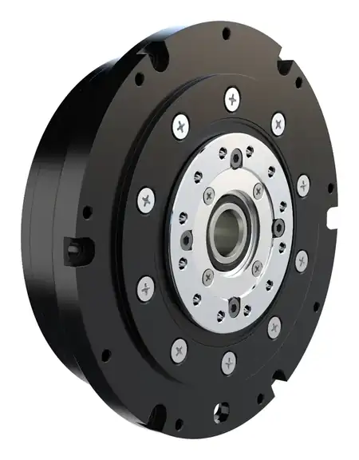

# CPM-100-25 Integrated Cycloidal Joint Module

## Product Overview

CPM-100-25 is a compact, high-torque robot joint module using an integrated cycloidal pinwheel transmission. Its 100 mm outer diameter and 29.5 mm axial thickness make it suitable for robot joints that require high torque in a low-profile package.

The product can be supplied with or without an integrated driver. Driver, encoder, communication and closed-loop control functions apply only to the configuration confirmed in the quotation.

{ width="900" loading="lazy" }

The image above shows the version without an integrated driver.

## Product Identity

| Item | Description |
| --- | --- |
| Model | CPM-100-25 |
| Product type | Integrated cycloidal robot joint module |
| Transmission | Cycloidal pinwheel |
| Main material | Steel |
| Driver configuration | With or without integrated driver |

## Key Benefits

- 25 Nm rated output torque
- 75 Nm peak output torque
- 29.5 mm low-profile thickness
- 5-10 arcmin backlash
- 24-48 VDC operating range
- 500 N allowable radial load
- Optional integrated control configuration

## Key Specifications

| Parameter | Value |
| --- | --- |
| Transmission structure | Cycloidal pinwheel |
| Outer diameter | 100 mm |
| Product thickness | 29.5 mm |
| Reduction ratio | 25:1 |
| Backlash | 5-10 arcmin |
| Operating voltage | 24-48 VDC |
| Rated motor power | 213 W |
| Rated output speed | 60 rpm |
| No-load output speed | 90 rpm |
| Rated output torque | 25 Nm |
| Peak output torque | 75 Nm |
| Weight | 630 g |
| Allowable radial force | 500 N |
| Allowable axial force | 300 N |

## Peak Torque Condition

Peak torque: **75 Nm**

Peak duration depends on operating voltage, current limit, duty cycle and thermal conditions. Confirm the required peak-torque duration with SigGear before selection.

## Motor and Electrical Parameters

| Parameter | Value |
| --- | --- |
| Motor KV value | 63 rpm/V |
| Thermistor | 10 kOhm, B3435, +/-1% |
| Phase inductance | 290 uH |
| Phase current full scale | 33 A |
| Rated bus current | 15 A |
| Static working bus current | 0.08 A |
| Back-EMF constant | 0.143 Vs/rad |

## Driver and Encoder Configuration

Two representative configurations are shown on this page:

- **Without integrated driver:** motor and cycloidal transmission assembly for connection to an external driver selected by the customer or project.
- **With integrated driver:** driver housing, interface and control hardware are integrated into the selected module configuration.

Encoder, communication, closed-loop control, connector and cable details must be confirmed in the quotation and technical agreement.

## Mechanical Load Capacity

| Parameter | Value |
| --- | --- |
| Allowable radial force | 500 N |
| Allowable axial force | 300 N |

Actual suitability depends on mounting geometry, load position, duty cycle, speed and shock loading.

## Recommended Applications

- Humanoid robot joints
- Quadruped robot joints
- Robotic arms
- Exoskeleton systems
- Rehabilitation robots
- Compact industrial automation joints
- Research and development platforms

## Product Images

### Version without integrated driver

{ width="900" loading="lazy" }

### Version with integrated driver

{ width="900" loading="lazy" }

The images show representative configurations. The version without an integrated driver is intended for connection to an external drive solution selected for the project. The driver-equipped version includes the selected driver housing and interface arrangement. Final driver, encoder, connector, cable, communication and control functions must be confirmed in the quotation.

## CAD and Technical Files

STEP models, 2D drawings, detailed mounting drawings and interface documents are available upon request. Please include your application, required torque, speed, voltage, estimated quantity and preferred driver configuration.

**Request CAD Files:** [Contact Wanrong Wang](../../contact.md)

## Noise, Life and Thermal Data

Noise-test records, service-life parameters and application-specific thermal limits are provided after application review. These values are not published as universal specifications because they depend on installation, load, speed, lubrication, duty cycle and thermal conditions.

## Selection Information Required

Please provide:

- Application and installation position
- Rated and peak torque
- Required peak-torque duration
- Required output speed
- Operating voltage
- Size and weight limits
- Duty cycle
- Radial and axial loads
- Driver, encoder and communication requirements
- Estimated prototype and annual quantity

## Contact SigGear

**Wanrong Wang**  
International Sales, SigGear  
[wangwanrong@siggear.com](mailto:wangwanrong@siggear.com)
