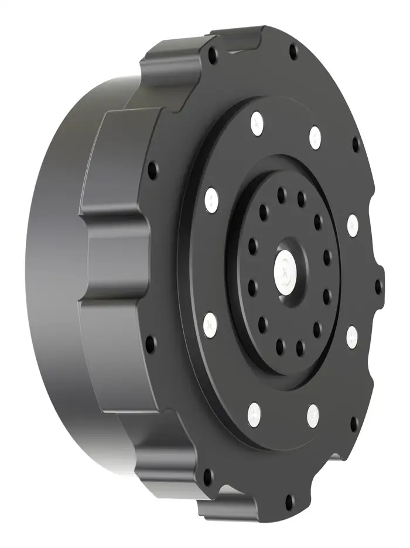
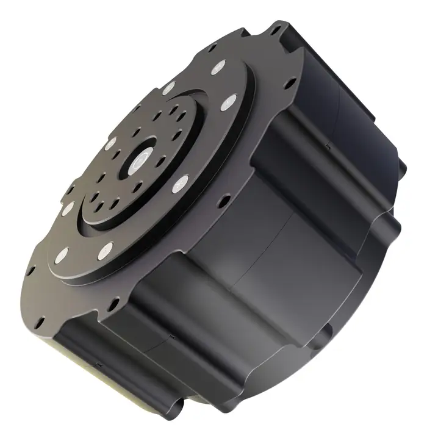

# CPM-80-25 Integrated Cycloidal Joint Module

## Product Overview

CPM-80-25 is a compact robot joint module using an integrated cycloidal pinwheel transmission. Its 80 mm outer diameter, 29.7 mm axial thickness and 25:1 reduction ratio make it suitable for robot joints that require compact dimensions, moderate output torque and relatively high output speed.

The product can be supplied with or without an integrated driver. Driver, encoder, communication and closed-loop control functions apply only to the configuration confirmed in the quotation.

{ width="720" loading="lazy" }

The image above shows the version without an integrated driver.

## Product Identity

| Item | Description |
| --- | --- |
| Model | CPM-80-25 |
| Product type | Integrated cycloidal robot joint module |
| Transmission | Cycloidal pinwheel |
| Main material | Steel |
| Driver configuration | With or without integrated driver |

## Key Benefits

- Compact 80 mm outer diameter
- Thin 29.7 mm axial profile
- 10 Nm rated output torque
- 50 Nm peak output torque
- 120 rpm rated output speed
- 5-10 arcmin backlash
- 24-48 VDC operating range
- Optional integrated control configuration

## Key Specifications

| Parameter | Value |
| --- | --- |
| Transmission structure | Cycloidal pinwheel |
| Outer diameter | 80 mm |
| Product thickness | 29.7 mm |
| Reduction ratio | 25:1 |
| Backlash | 5-10 arcmin |
| Operating voltage | 24-48 VDC |
| Rated motor power | 500 W |
| Rated output speed | 120 rpm |
| No-load output speed | 168 rpm |
| Rated output torque | 10 Nm |
| Peak output torque | 50 Nm |
| Weight | 430 g |
| Allowable radial force | 500 N |
| Allowable axial force | 500 N |

## Peak Torque Condition

Peak torque: **50 Nm**

Peak duration depends on operating voltage, current limit, duty cycle and thermal conditions. Confirm the required peak-torque duration with SigGear before selection.

## Motor and Electrical Parameters

| Parameter | Value |
| --- | --- |
| Motor KV value | 104 rpm/V |
| Thermistor | 10 kOhm, B3435, +/-1% |
| Phase inductance | 235 uH |
| Phase current full scale | 33 A |
| Rated bus current | 12 A |
| Static working bus current | 0.08 A |
| Motor structure | 18 slots / 20 poles |
| Phase resistance | 224 uOhm |
| NTC B value | 3435 |
| Back-EMF constant | 0.0727 Vs/rad |

## Driver and Encoder Configuration

Two representative configurations are shown on this page:

- **Without integrated driver:** motor, cycloidal transmission and Hall-sensor wiring are supplied as a mechanical and motor assembly.
- **With integrated driver:** the module includes the selected driver housing and interface arrangement shown in the product images.

Encoder, communication, closed-loop control, connector and cable details must be confirmed in the quotation and technical agreement.

## Communication and Control

For a driver-equipped configuration, available communication and control functions are confirmed according to the selected driver and project requirements.

Possible project configurations may include:

- CAN communication
- RS485 communication
- Position control
- Velocity control
- Torque control
- PID closed-loop control

Final functions, protocol details and control limits must be confirmed in the quotation and technical agreement.

## Mechanical Load Capacity

| Parameter | Value |
| --- | --- |
| Allowable radial force | 500 N |
| Allowable axial force | 500 N |

The suitability of the joint module for external radial and axial loads depends on the installation geometry, load direction, speed and duty cycle.

## Standard Mechanical Configuration

The standard mechanical assembly includes:

- BLDC motor
- Cycloidal pinwheel reduction mechanism
- Housing and output structure

Electrical and control components depend on the selected configuration.

## Optional Configuration

- Integrated driver
- Encoder and sensor configuration
- CAN or RS485 communication
- Custom cables and connectors
- Custom mechanical interfaces
- Customer branding and labeling

## What Is Not Automatically Included

Unless specifically stated in the quotation, the following are not automatically included:

- External power supply
- Host controller
- Communication adapter
- Application-specific mounting hardware
- STEP model or detailed production drawing
- Noise-test report
- Service-life report

## Recommended Applications

- Humanoid robot joints
- Quadruped robot joints
- Compact robotic arms
- Exoskeleton joints
- Rehabilitation robots
- Research and education platforms

## Product Images

| Version without integrated driver | Version with integrated driver |
| --- | --- |
|  |  |

The images show representative mechanical configurations. The version without an integrated driver includes the motor and cycloidal transmission assembly with its sensor wiring. The driver-equipped version uses a different rear housing and interface arrangement. Final driver, encoder, connector, cable, communication and control functions must be confirmed in the quotation.

## CAD and Drawings

STEP models, 2D drawings, detailed mounting drawings and interface documents are available upon request. Please include your application, required torque, speed, voltage, estimated quantity and preferred configuration.

**Request CAD Files:** [Contact Wanrong Wang](../../contact.md)

## Selection Information Required

Please provide:

- Application and installation position
- Rated and peak torque
- Required peak-torque duration
- Required output speed
- Operating voltage
- Size and weight limits
- Duty cycle
- External radial and axial loads
- Driver and encoder requirement
- Communication interface
- Estimated prototype and annual quantity

## Contact SigGear

**Wanrong Wang**  
International Sales, SigGear  
[wangwanrong@siggear.com](mailto:wangwanrong@siggear.com)
