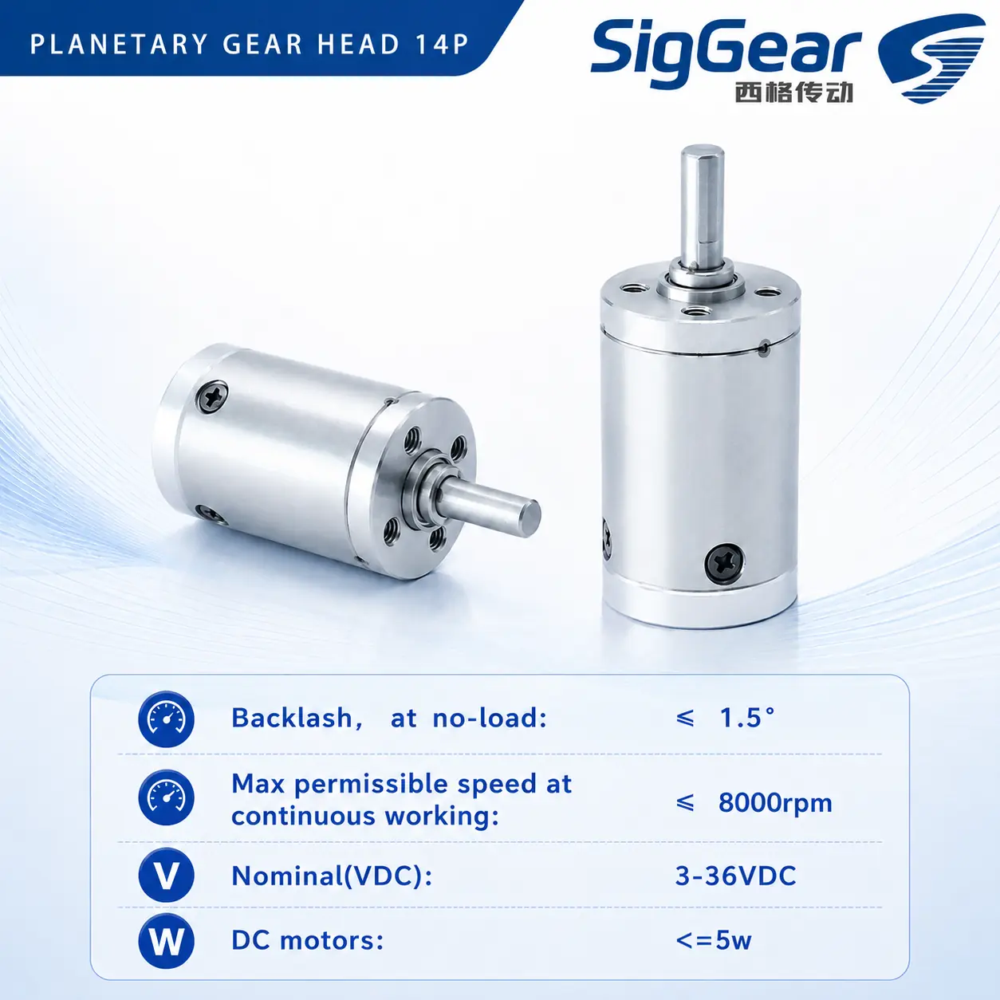
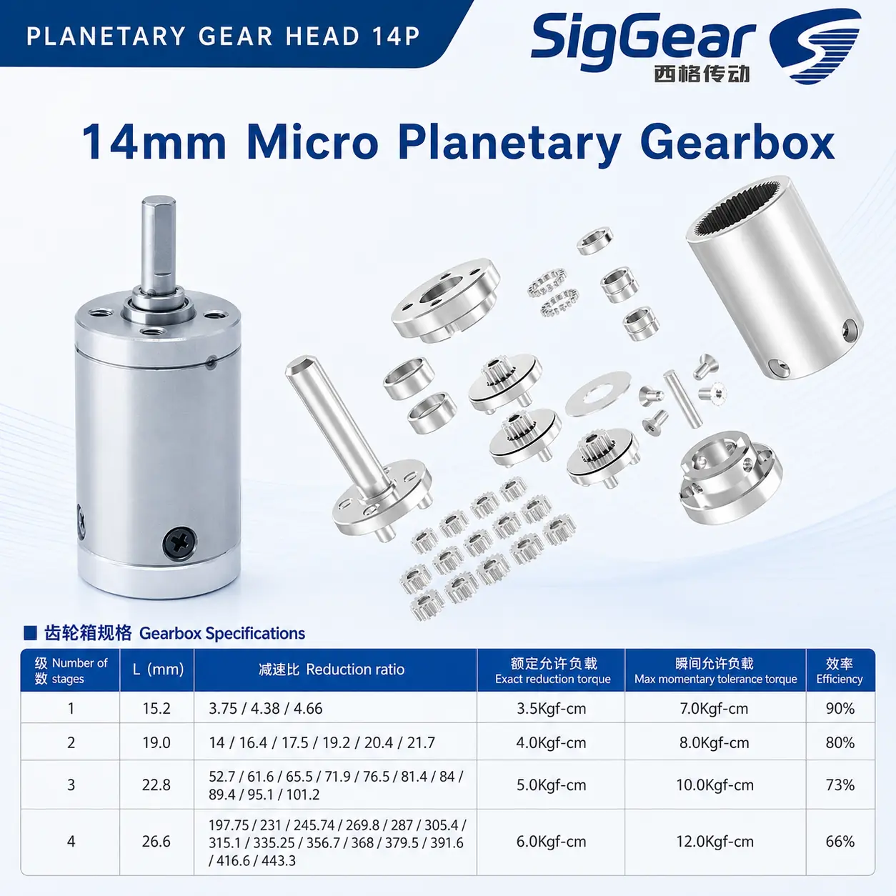
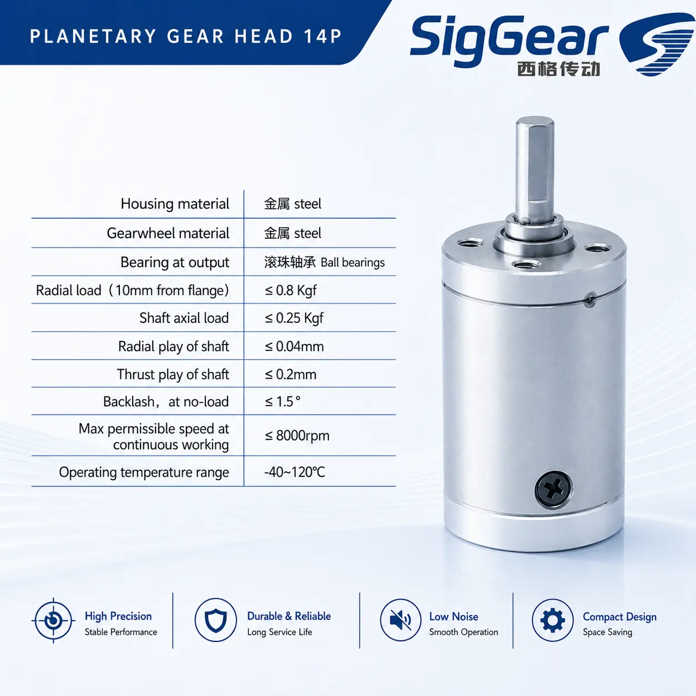
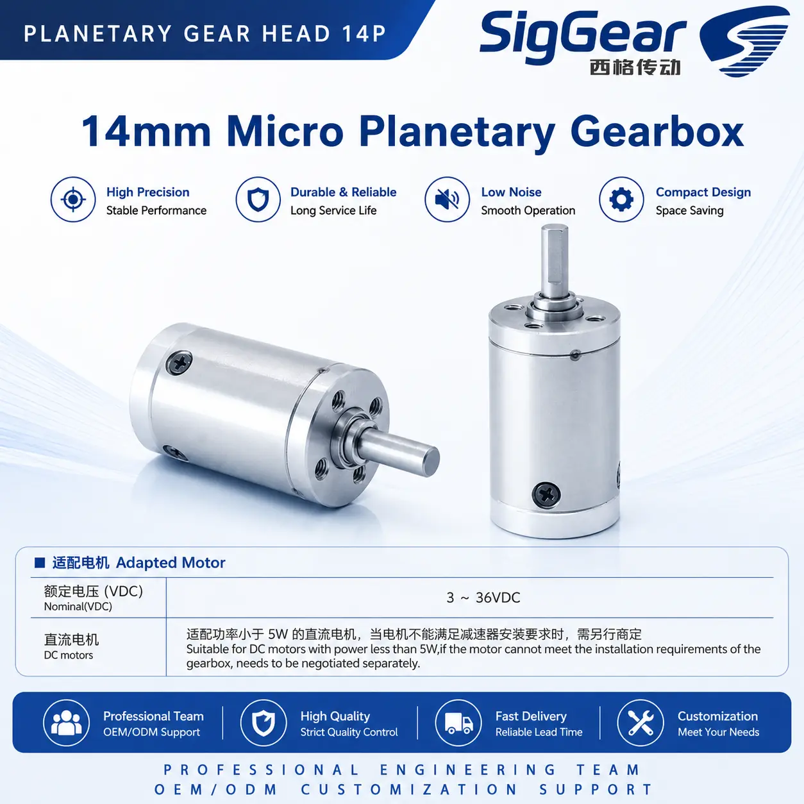
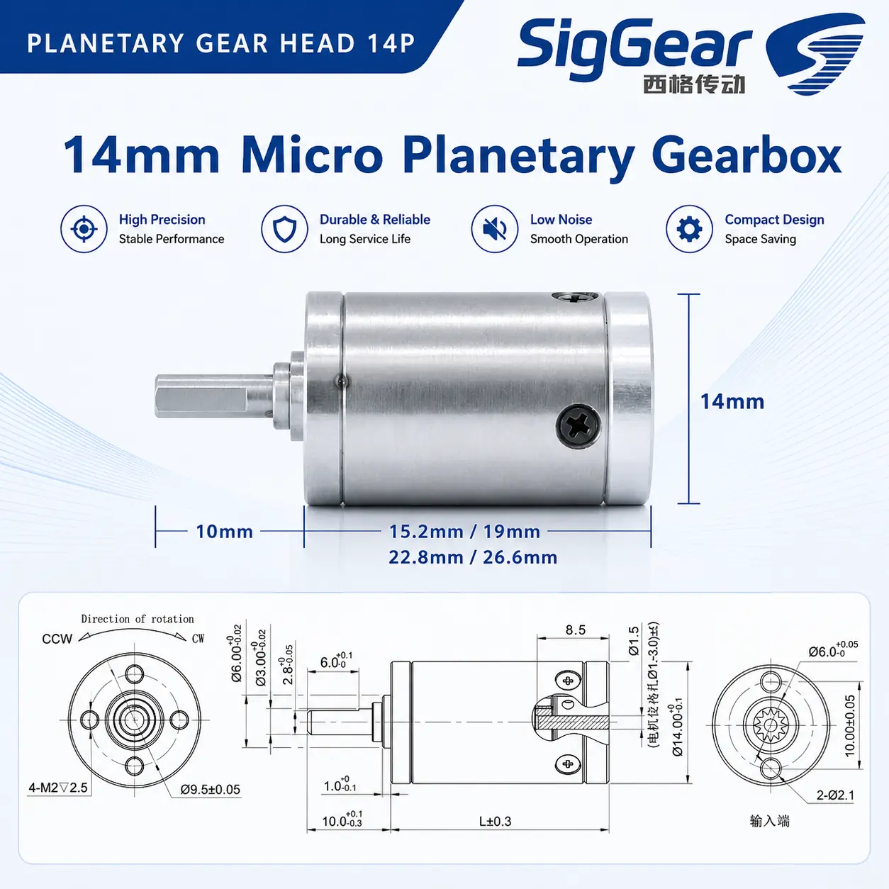

# 14P 14 mm Micro Planetary Gearbox

## Product Overview

The SigGear 14P is a 14 mm micro planetary gearbox for compact motorized mechanisms. The published configurations cover one to four stages, with reduction ratios from 3.75:1 to 443.3:1.

## Product Identity

| Item | Description |
| --- | --- |
| Model | 14P |
| Product type | Micro planetary gearbox |
| Nominal outer diameter | 14 mm |
| Number of stages | 1 to 4 |
| Housing material | Steel |
| Gearwheel material | Steel |
| Output bearing | Ball bearing |

## Key Specifications

| Parameter | Published value |
| --- | ---: |
| Nominal outer diameter | 14 mm |
| Gearbox length range | 15.2–26.6 mm |
| Reduction ratio range | 3.75:1–443.3:1 |
| Rated allowable torque range | 3.5–6.0 kgf·cm |
| Maximum momentary torque range | 7.0–12.0 kgf·cm |
| Efficiency range | 66–90% |
| Backlash at no load | ≤ 1.5° |
| Maximum permissible speed, continuous operation | ≤ 8,000 rpm |
| Operating temperature | −40 to 120 °C |

Torque values are preserved in the source unit, kgf·cm. Maximum momentary torque is not a continuous working rating.

## Stage, Ratio and Performance Table

| Stages | Gearbox length L | Available reduction ratios | Rated allowable torque | Maximum momentary torque | Efficiency |
| ---: | ---: | --- | ---: | ---: | ---: |
| 1 | 15.2 mm | 3.75 / 4.38 / 4.66 | 3.5 kgf·cm | 7.0 kgf·cm | 90% |
| 2 | 19.0 mm | 14 / 16.4 / 17.5 / 19.2 / 20.4 / 21.7 | 4.0 kgf·cm | 8.0 kgf·cm | 80% |
| 3 | 22.8 mm | 52.7 / 61.6 / 65.5 / 71.9 / 76.5 / 81.4 / 84 / 89.4 / 95.1 / 101.2 | 5.0 kgf·cm | 10.0 kgf·cm | 73% |
| 4 | 26.6 mm | 197.75 / 231 / 245.74 / 269.8 / 287 / 305.4 / 315.1 / 335.25 / 356.7 / 368 / 379.5 / 391.6 / 416.6 / 443.3 | 6.0 kgf·cm | 12.0 kgf·cm | 66% |

## Shaft and Load Limits

| Parameter | Published value |
| --- | ---: |
| Radial load, measured 10 mm from flange | ≤ 0.8 kgf |
| Shaft axial load | ≤ 0.25 kgf |
| Radial shaft play | ≤ 0.04 mm |
| Thrust shaft play | ≤ 0.2 mm |

## Motor Compatibility

The detailed adapted-motor sheet identifies DC motors with a nominal voltage of **3–36 VDC** and power **below 5 W**. If a motor cannot meet the gearbox installation requirements, motor matching must be negotiated separately.

The summary artwork expresses the motor-power limit as “≤ 5 W,” while the detailed adapted-motor sheet says “less than 5 W.” This page uses the stricter **below 5 W** condition until the boundary is technically reconciled.

These are adapted-motor conditions, not an electrical voltage or power rating for the mechanical gearbox itself. Confirm the motor shaft, mounting interface, input speed, duty cycle and operating point for the selected gearbox ratio.

## Dimensions and Interface

The published drawing shows a 14 mm body, a 10.0 mm output-shaft extension and stage-dependent gearbox lengths of 15.2, 19.0, 22.8 and 26.6 mm. Use the drawing below for the complete shaft, mounting, input-interface and tolerance notation.

## Typical Applications

- Micro robotics and compact actuators
- Medical and laboratory automation mechanisms
- Precision instruments and optical adjustment mechanisms
- Mini pumps and valve drives
- Compact grippers and smart hardware

Application suitability depends on the selected ratio, motor, load direction, duty cycle, installation and required service life.

## Selection Information Required

Please provide:

- Required reduction ratio or output speed
- Continuous and momentary output torque
- Motor type, voltage, power, speed and shaft dimensions
- Available gearbox length and mounting interface
- Output-shaft requirements
- Radial and axial loads
- Duty cycle and ambient temperature
- Backlash, noise and service-life targets
- Prototype and annual quantity

Do not transfer the 14P specifications to another frame size or an unlisted stage configuration. Final selection and quotation require confirmation against the approved configuration drawing.

## Contact SigGear

**Wanrong Wang**

International Sales, SigGear

[wangwanrong@siggear.com](mailto:wangwanrong@siggear.com)
